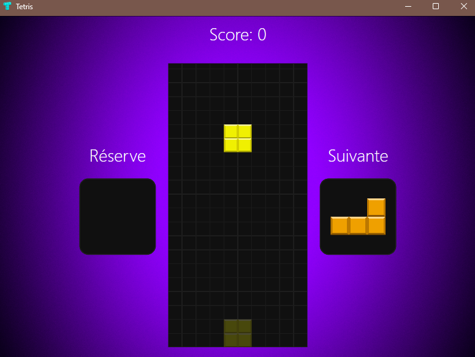
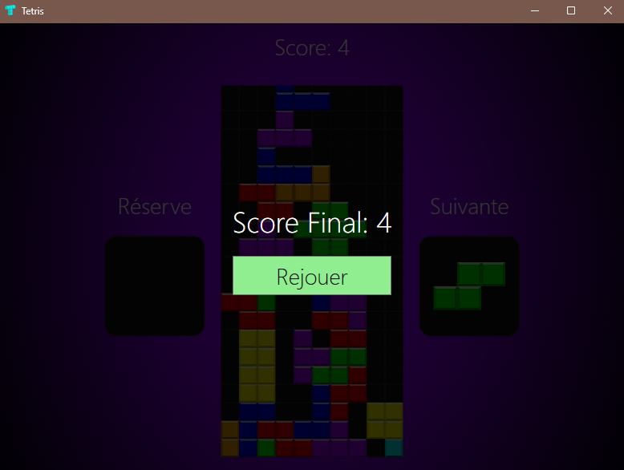

# Tetris 

Petit projet perso pour apprendre le C# et WPF en faisant un Tetris.
Le code est bas� sur un tutoriel, mais adapt� et traduit en fran�ais.

## Technologies utilis�es 
* **Langage** : C# 
* **Framework** : WPF, .NET 10.0
* **IDE recommand�** : Visual Studio community 2026

## Aperçu du projet

## Lancer le jeu 
* ./start.bat � la racine du projet sur Windows

##  Contr�les
* **Fl�ches Gauche/Droite** : Bouger la pi�ce
* **Fl�che Haut** : Tourner la pi�ce dans le sens des aiguilles d'une montre
* **Z** : Tourner la pi�ce dans le sens inverse des aiguilles d'une montre
* **Fl�che Bas** : Descendre plus vite
* **Espace** : chute acc�l�r�e
* **C** : Mettre en r�serve

##  �tat du projet
* [x] Grille de jeu fonctionnelle
* [x] Syst�me de blocs (I, J, L, O, S, T, Z)
* [x] Gravit� et collisions de base
* [x] Affichage graphique (WPF)
* [x] Rotation compl�te
* [x] Score et niveaux
* [x] Game Over
* [x] Syst�me de chute acc�l�r�e et bloc fant�me
* [x] Syst�me de mise en r�serve 
* [x] Affichage du prochain bloc
* [ ] Menu de pause
* [ ] Ajouter des sons
* [ ] Améliorer le système de score + système de combos